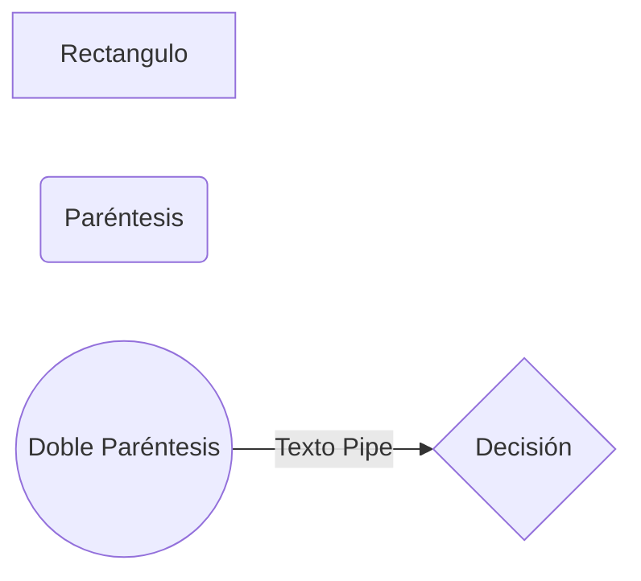
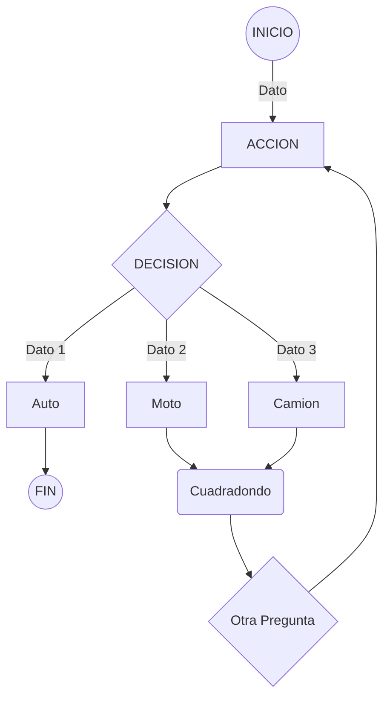

## Machete MD+Mermaid
Machete de objetos en Mermaid para MarkDown (MD):

| Símbolos           | Resultado                          
|--------------------|-------------------------------
|Corchetes []        | Crean Rectángulos
|Paréntesis simples()| Crean Rectángulos redondeados
|Doble Paréntesis(())| Crean Círculos
|Llaves {}           | Crean Rombos de Decisión
|Pipe \|texto\|        | Se utiliza para texto fuera de un objeto
|Flecha -->        | Se utiliza para definir ownership

## ejemplo

## Ejemplo FLujo de markdown + Mermaid 

