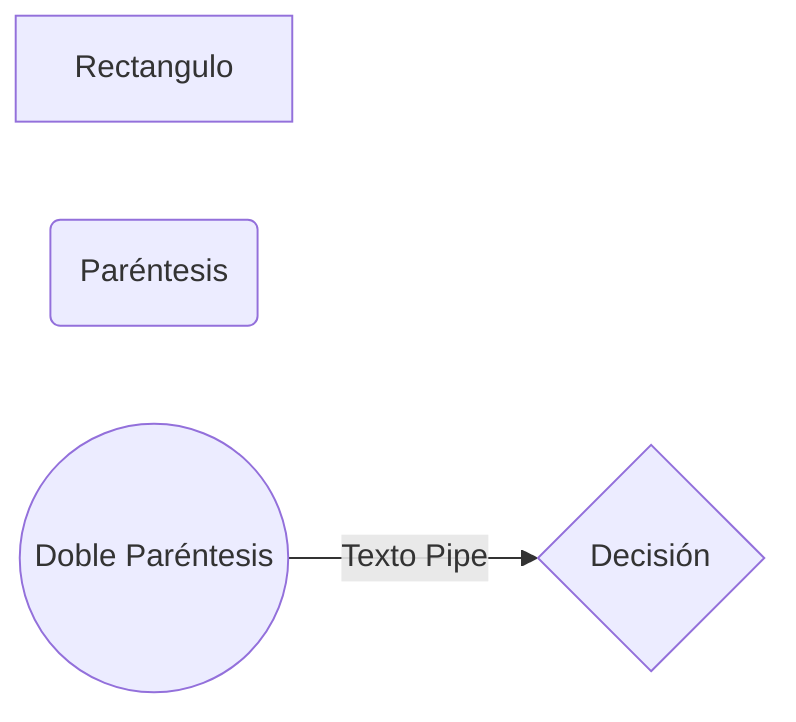
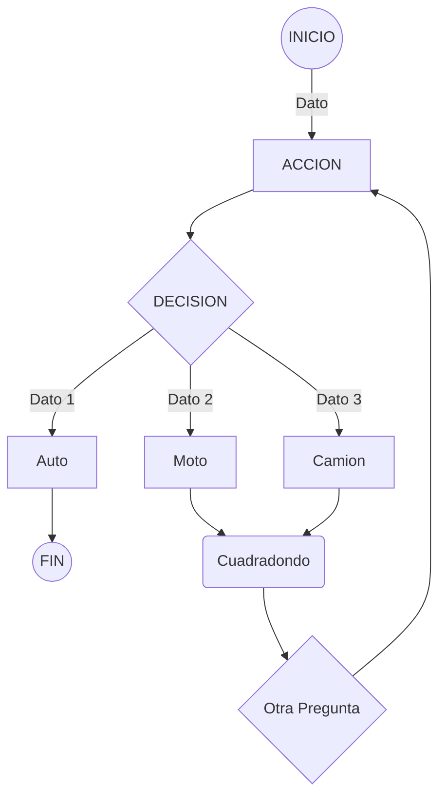

# Markdown 
Markdown es un lenguaje de marcado ligero creado por John Gruber y Aaron Swartz que trata de conseguir la máxima legibilidad y facilidad de publicación tanto en su forma de entrada como de salida, inspirándose en muchas convenciones existentes para marcar mensajes de correo electrónico usando texto plano.
[Link](https://docs.github.com/es/get-started/writing-on-github/getting-started-with-writing-and-formatting-on-github/basic-writing-and-formatting-syntax)

# Mermaid
Mermaid es una herramienta inspirada en Markdown que representa texto en diagramas. Por ejemplo, Mermaid puede representar gráficos de flujo, diagramas de secuencia, gráficos circulares y mucho más.
[Link](https://mermaid.js.org/) 
Editor online de Mermaid: [Link](https://mermaid.live/)

## Cheatsheet MD+Mermaid
Cheatsheet de objetos en Mermaid para MarkDown (MD):

| Símbolos           | Resultado                          
|--------------------|-------------------------------
|Corchetes []        | Crean Rectángulos
|Paréntesis simples()| Crean Rectángulos redondeados
|Doble Paréntesis(())| Crean Círculos
|Llaves {}           | Crean Rombos de Decisión
|Pipe \|texto\|      | Se utiliza para texto fuera de un objeto
|Flecha -->          | Se utiliza para definir ownership

## Ejemplo

## Ejemplo Flujo de markdown + Mermaid 

